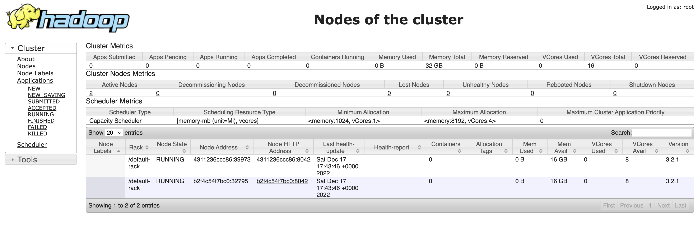

# HW01

## Задание 1
## Развертывание локального кластера Hadoop

## Задание 2
## Написать map-reduce на Python

1. Доустановлен Python3.
    
2. Cкрипт для запуска:
        
    $ hadoop jar /opt/hadoop-3.2.1/share/hadoop/tools/lib/hadoop-streaming-3.2.1.jar -files mapper.py,reducer.py 
    -mapper "/usr/bin/python3 mapper.py" -reducer "/usr/bin/python3 reducer.py" -input /AB_NYC_2019.csv -output /output3
    

3. Результат:    
    
    
